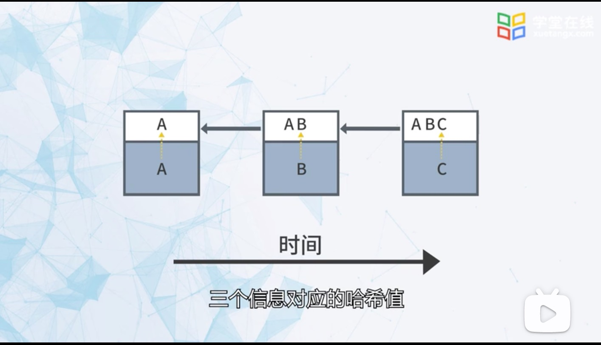

1. 比特币总量确定为2100万枚，系统每隔十分中就会产生50枚比特币，每隔四年发行的币减半，2140年所有比特币发行完毕

   

   

2. 区块链是一个区块

   

   

  + 摘要

     高度

     数量

     算法

  + 交易

    从一个地址向另一个地址转让比特币的交易

    第一个交易是系统发送的

2. 点对点转账

3. 比特币是区块链的货币

4. 中介机构

   转账： 张三给李四转账，银行就是中间结构

   双花：同一笔钱因操作不当被重复使用，比如第一笔钱没有实时划掉

5. 密码

+ 对称加密

    加密和解密使用同一个密钥

+ 非对称加密

    有一对密钥，公钥（public) 和 私钥（private)

   + 使用公钥加密，私钥解密

        ***非对称加密主要防止信息在传输过程中被别人看到***

    + 或者私钥加密，公钥解密

        用于验证交易是私钥的拥有者发起的

    公钥是所有人都可以看见的，私有是只有自己可以看见的

6. 数字签名

+ 生成私钥和公钥：generatekeys

    私钥：私密，用于签名
    公钥： 公开，用于验证签名

+ 生成数字签名：sign

    数字签名 = SIGN(私钥，message)

+ 验证签名：verify

    verify(公钥，message，数字签名)

7. 钱包地址 

    钱包地址和公钥一一对应

8. 哈希函数

    任意形式的数据经过哈希运算得到固定长度的值，比特币采用的是sha256,256为的长度

    

    两大特征： 不能反推

    即使知道哈希算法得到的固定长度值，不能反推原数据是什么值。

    
    

    第二个特征： 两个不同的x 不能得到相同的y

    哈希值和原始数据是一一对应的

    

9. 比特币

    

    比特币一个区块的容量是1M，

    

    因此很多人认为比特币需要扩容，有很多人认为扩容会导致比特币不安全，因为扩容要存储的数据会增多，对机器硬件成本较高，很多人不愿意在参与比特币。

    2017年比特币出现了分叉，BCH(硬分叉)，导致产生一个新链

    软分叉：

    