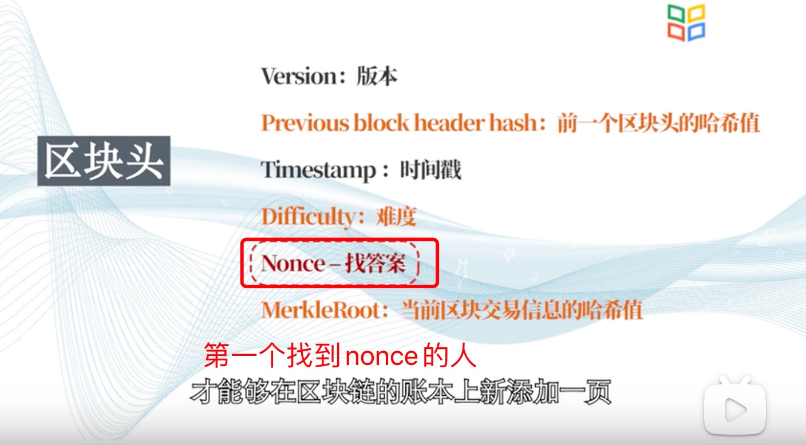
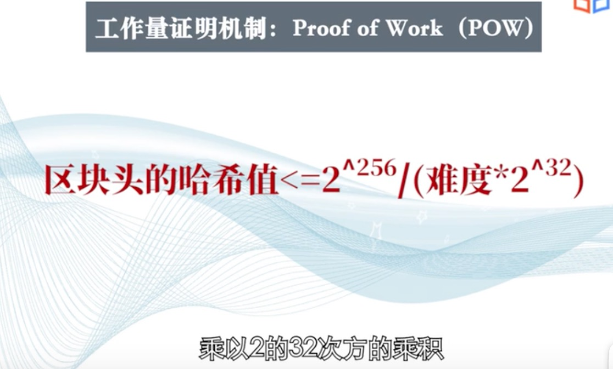
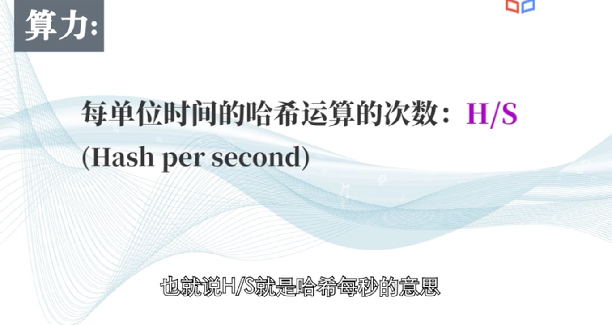
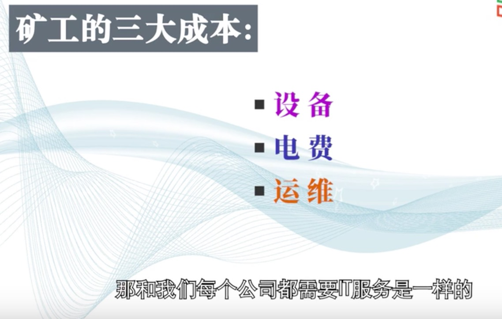

1. 共识机制

   + 最长链

      账本添加在最长链里面，大家会共同维护一个账本

   + 工作量证明机制

      

      需要找到nonce,是的当前区块头的哈希值小于系统规定的数

      系统规定的数
      

      难度

      
    
    找到nonce 以后需要全网广播，然后验证nonce是否有用

    

2. 矿工的激励

   给矿工的奖励：开始50个比特币，每四年减半（2020年5约为6.25个）

   第二个奖励： 所有交易的手续费，

3. 算力

    
    

    

4. 时间是格林时间